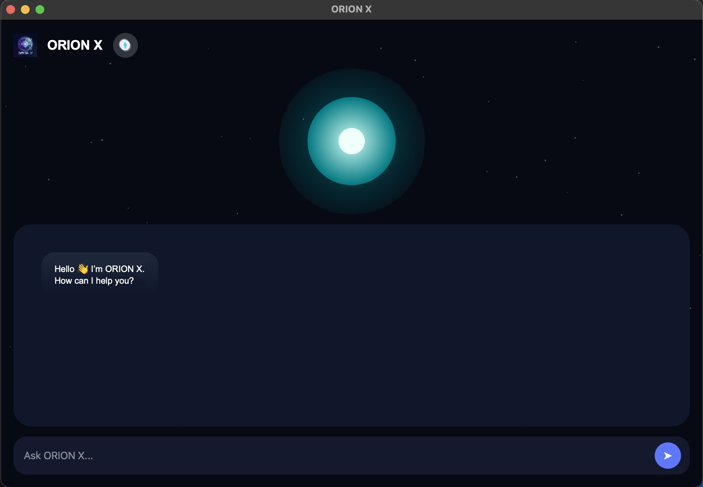
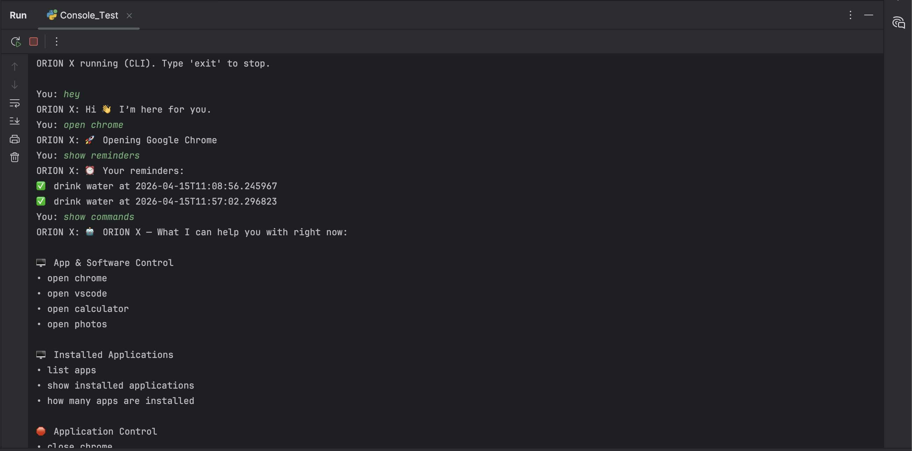

<div align="center">

<!-- HERO BANNER -->


<br/>

<!-- ANIMATED TYPING TITLE -->
<a href="#">

</a>


<br/><br/>

<!-- STATUS BADGES -->


<br/>

<!-- TECH STACK BADGES -->


<br/>


<br/><br/>

<!-- ===== DEMO VIDEO SECTION ===== -->

<a href="https://drive.google.com/file/d/1heV0lzODjndfy4hlWVf8q_wPRK2MtFBY/view?usp=drivesdk">

</a>

<br/>

[](https://drive.google.com/file/d/1heV0lzODjndfy4hlWVf8q_wPRK2MtFBY/view?usp=drivesdk)
[](https://drive.google.com/file/d/1heV0lzODjndfy4hlWVf8q_wPRK2MtFBY/view?usp=drivesdk)
[](https://drive.google.com/file/d/1heV0lzODjndfy4hlWVf8q_wPRK2MtFBY/view?usp=drivesdk)

<br/>

> 🎬 **The demo video covers:** GUI interface walkthrough · CLI interactions · Voice command execution · ML predictions · NLP features · Math engine · Reminders & Scheduler

<br/>

</div>

---

## ◈ What is ORION X?

<div align="center">

```
╔══════════════════════════════════════════════════════════════════╗
║                                                                  ║
║   ORION X is not just a chatbot.                                 ║
║   It is a complete autonomous AI ecosystem.                      ║
║                                                                  ║
║   ─ Understands natural language with ML-powered intent engine   ║
║   ─ Executes real OS commands: open apps, find files, search     ║
║   ─ Predicts exam marks, salary, classifies spam & sentiment     ║
║   ─ Sets reminders, schedules meetings, runs daily routines      ║
║   ─ Available via GUI, CLI, and Voice — simultaneously           ║
║                                                                  ║
╚══════════════════════════════════════════════════════════════════╝
```

</div>

<table>
<tr>
<td width="58%">

**ORION X** is a full-stack, multi-modal AI assistant that bridges natural language understanding with real-world system execution. Unlike toy projects or simple chatbots, ORION X is a production-grade autonomous agent with a layered architecture:

- 🧠 **ML at its core** — TF-IDF vectorizer + Logistic Regression trained on a custom-labeled intent dataset
- 🗣️ **NLP pipeline** — spaCy NER combined with custom rule-based entity extractors
- 🖥️ **Triple interface** — Professional PySide6 GUI, a clean CLI, and Whisper-powered voice
- ⚙️ **Real automation** — opens apps, locates files, searches the web, sets OS-level reminders
- 📊 **Embedded ML models** — regression for marks & salary, NLP classifiers for spam & sentiment
- 🧮 **Math engine** — parses natural language arithmetic, statistics, and algebra

Built as a **modular, stateless system** using JSON-based persistence and a professional skill-router architecture.

</td>
<td width="42%" align="center">

```
╔══════════════════════════╗
║      ORION X CORE        ║
╠══════════════════════════╣
║  ┌──────────────────┐    ║
║  │  Input Layer     │    ║
║  │  GUI / CLI / 🎤  │    ║
║  └────────┬─────────┘    ║
║           ▼              ║
║  ┌──────────────────┐    ║
║  │ Intent Classifier│    ║
║  │  TF-IDF + LogReg │    ║
║  └────────┬─────────┘    ║
║           ▼              ║
║  ┌──────────────────┐    ║
║  │   NER Engine     │    ║
║  │ spaCy + Rules    │    ║
║  └────────┬─────────┘    ║
║           ▼              ║
║  ┌──────────────────┐    ║
║  │  Skill Router    │    ║
║  │  10+ Modules     │    ║
║  └──────────────────┘    ║
╚══════════════════════════╝
```

</td>
</tr>
</table>

---

## ◈ Interface Modes

<div align="center">

| Interface | Technology | Description | Use Case |
|:---------:|:-----------:|:-----------:|:---------:|
| 🖥️ **GUI** | PySide6 (Qt6) | Full visual interface with voice button, animated responses | Primary daily use |
| 💻 **CLI** | Pure Python console | Lightweight, instant, no dependencies | Developer / power users |
| 🎤 **Voice** | Whisper ASR + SpeechRecognition | Hands-free speech-to-text command input | Hands-free / accessibility |

</div>

All three interfaces share the **same processing pipeline** — the intent classifier, NER engine, and skill router are fully interface-agnostic.

---

## ◈ Feature Arsenal

<details>
<summary><b>🗣️ Natural Language Understanding — Intent Classification + NER</b></summary>

<br/>

| Capability | Implementation | Details |
|------------|---------------|---------|
| Intent Classification | TF-IDF Vectorizer + Logistic Regression | Trained on a custom-labeled JSON dataset (`Final_Data.json`) covering 16+ intent categories |
| Entity Extraction | spaCy NER + Custom Rule-Based Patterns | Extracts apps, filenames, dates, times, persons, queries, numeric values |
| Command Parsing | Multi-token phrase resolution | Handles aliases, fuzzy match, multi-word intents |
| Context Handling | Stateless per-turn with smart defaults | Each turn is independent; entities are resolved in isolation |

**Sample NLU pipeline output:**
```
Input:  "schedule a meeting with Bhargav on 25 Jan at 9:20 pm for AI-ML"

→ Intent:  SCHEDULE_MEETING          (confidence: 98.7%)
→ Entities: person="Bhargav", date="Jan 25", time="21:20", topic="AI-ML"
→ Skill:   automation.meeting_store → Save to meetings.json ✅
```

```
Input:  "open chrome and search for machine learning projects"

→ Intent:  APP_OPEN + WEB_SEARCH     (multi-intent)
→ Entities: app="chrome", query="machine learning projects"
→ Skills:  system.app_control → Open chrome
           automation.browser_ops → Search Google ✅
```

</details>

<details>
<summary><b>⚙️ System Automation — Apps, Files, OS Control</b></summary>

<br/>

```
╔═══════════════════════════════════════════════════════════════╗
║          SYSTEM AUTOMATION CAPABILITIES                       ║
╠══════════════════╦════════════════╦═════════════════════════╗ ║
║   APP CONTROL    ║  FILE SYSTEM   ║   APP DISCOVERY         ║ ║
║ ──────────────── ║ ──────────────  ║ ──────────────────────  ║ ║
║ ✦ Open by name  ║ ✦ Find files   ║ ✦ List all apps         ║ ║
║ ✦ Close / Quit  ║ ✦ Locate paths ║ ✦ Count installed apps  ║ ║
║ ✦ Force quit    ║ ✦ Folder scan  ║ ✦ Show app info         ║ ║
║ ✦ Alias resolve ║ ✦ Keyword find ║ ✦ Fuzzy name matching   ║ ║
╚══════════════════╩════════════════╩═════════════════════════╩═╝
```

**Supported applications (with alias resolution):**
- Chrome / Google Chrome / Browser
- VSCode / Visual Studio Code / Editor
- Calculator, Notepad, Photos, Terminal, YouTube

**File search capabilities:**
- Exact filename: `find Main.py`
- Keyword match: `find resume` (matches all files containing "resume")
- Natural phrasing: `where is orion_x_logo.png`
- Category terms: `find data file`, `find config file`

</details>

<details>
<summary><b>🌐 Web Intelligence — Google & YouTube Automation</b></summary>

<br/>

| Command Pattern | Intent | Action |
|----------------|--------|--------|
| `google [query]` | WEB_SEARCH_GOOGLE | Opens Google with query |
| `search google for [query]` | WEB_SEARCH_GOOGLE | Direct Google search |
| `search youtube for [query]` | WEB_SEARCH_YOUTUBE | YouTube search automation |
| `youtube play [content]` | YOUTUBE_PLAY | Direct YouTube playback |
| `open youtube and search [query]` | MULTI_INTENT | Opens YT + searches |

All web operations execute via `skills/automation/executors/browser_ops.py` using OS-native subprocess calls.

</details>

<details>
<summary><b>📊 Machine Learning Predictions — Regression Models</b></summary>

<br/>

**🎓 Academic Marks Predictor**

```python
Model:    Linear Regression (marks_prediction_model.joblib)
Input:    Study hours (numeric, supports decimals)
Output:   Predicted score / percentage out of 100
Dataset:  Student performance dataset (curated)

Example:
  "if i study for 6 hours"
  → Predicted Score: 82.4 / 100
```

**💼 Salary Estimator**

```python
Model:    Linear Regression (salary_model.joblib)
Input:    Years of professional experience (supports X.5)
Output:   Estimated CTC in INR (annual)
Dataset:  Experience-salary benchmark dataset

Example:
  "salary after 3 year experience"
  → Estimated CTC: ₹6.2 LPA
```

Both models are pre-trained, serialized with `joblib`, and loaded at runtime from `skills/ml_models/models/`.

</details>

<details>
<summary><b>📧 NLP Intelligence — Spam Detection & Sentiment Analysis</b></summary>

<br/>

**Email Spam Detector** (`spam_model.joblib`)

```
Trigger: "check email - <text>"

check email - congratulations you won 1 lakh rupees
→ 🚨 SPAM DETECTED  (confidence: 97.3%)

check email - meeting tomorrow at 10 am
→ ✅ LEGITIMATE      (confidence: 99.1%)

check email - invoice for your purchase
→ ✅ LEGITIMATE      (confidence: 96.8%)
```

**Sentiment Analyzer** (`twitter_sentiment_model.joblib`)

```
Trigger: "check sentiment - <text>"

check sentiment - i feel very happy today
→ 😊 POSITIVE  (score: 0.94)

analyze sentiment - i am stressed
→ 😟 NEGATIVE  (score: 0.81)

detect sentiment - this project is amazing
→ 😊 POSITIVE  (score: 0.97)
```

Both NLP models trained on real-world datasets. The spam model uses TF-IDF + Naive Bayes; sentiment uses the Twitter Sentiment model with custom preprocessing.

</details>

<details>
<summary><b>⏰ Productivity Suite — Reminders & Meeting Scheduler</b></summary>

<br/>

**Reminder Engine** → stored in `Json/reminders.json`

```
Relative (countdown-based):
  "remind me to drink water in 5 minutes"
  "set a reminder for take break in 30 minutes"

Absolute (clock-based):
  "remind me at 7:30 am"
  "set reminder at 14:45"

Management:
  "show reminders"   → Lists all active reminders
```

**Meeting Scheduler** → stored in `Json/meetings.json`

```
"schedule a meeting with Bhargav on 25 Jan at 9:20 pm for AI-ML"
→ ✅ Saved: Person=Bhargav | Date=Jan 25 | Time=21:20 | Topic=AI-ML

Full syntax:
  schedule/plan a meeting with <name> on <date> at <time> [for <topic>]

"show meetings"  → Lists all scheduled meetings
```

Both stores are JSON-based — persistent across sessions, zero database dependency.

</details>

<details>
<summary><b>🧮 Advanced Math Engine — Natural Language Arithmetic</b></summary>

<br/>

The math engine (`skills/math/math_engine.py` + `math_parser.py`) parses full natural language expressions:

| Operation | Example Input | Output |
|-----------|--------------|--------|
| Addition | `12 plus 5 minus 3` | `14` |
| Subtraction | `100 minus 40` | `60` |
| Multiplication | `25 multiply 4` | `100` |
| Division | `100 divided by 4` | `25.0` |
| Average | `average of 10 20 30 40` | `25.0` |
| Min | `min of 45 22 89 11` | `11` |
| Max | `max of 45 22 89 11` | `89` |
| Percentage | `total marks is 500 i got 450` | `90.0%` |
| Difference | `difference between 1000 and 845` | `155` |
| Square Root | `sqrt 144` | `12.0` |

Supports chained operations: `1224331-555-5555-55` → `1217166`

</details>

<details>
<summary><b>🧠 Smart Suggestions & Help System</b></summary>

<br/>

- `what can you do?` — Full interactive capability overview
- `what is - sentiment analysis` — Module-specific explanation with examples
- `what is - reminders` — Shows reminder syntax and examples
- `i feel stressed` → Detects negative sentiment → Triggers wellness tip + mood-aware response
- `start my day` → Daily routine launcher: date/time greeting + reminders + meetings + motivation

**Skill Suggestion Engine** (`skills/intelligence/suggestion_engine.py`):
- Detects emotional keywords (stressed, demotivated, sad, anxious)
- Classifies mood state
- Suggests relevant ORION X features contextually
- Optionally auto-runs sentiment analysis on the input

</details>

---

## ◈ System Architecture

```
╔══════════════════════════════════════════════════════════════════════╗
║                      ORION X ARCHITECTURE                            ║
╠══════════════════════════════════════════════════════════════════════╣
║                                                                      ║
║   INPUT LAYER                                                        ║
║   ┌───────────────┐   ┌───────────────┐   ┌──────────────────┐       ║
║   │  🖥️  GUI           💻  CLI                🎤  Voice       │       ║
║   │  PySide6/Qt6  │   │  Console      │   │  Whisper ASR     │       ║
║   └───────┬───────┘   └───────┬───────┘   └────────┬─────────┘       ║
║           └───────────────────┴────────────────────┘                 ║
║                               │                                      ║
║   PROCESSING LAYER            ▼                                      ║
║   ┌───────────────────────────────────────────────────────────┐      ║
║   │                  Intent Classifier                        │      ║
║   │          TF-IDF Vectorizer + Logistic Regression          │      ║
║   │          (intent_model.joblib + vectorizer.joblib)        │      ║
║   └─────────────────────────┬─────────────────────────────────┘      ║
║                             ▼                                        ║
║   ┌───────────────────────────────────────────────────────────┐      ║
║   │                   NER Engine                              │      ║
║   │         spaCy Named Entity Recognition                    │      ║
║   │         + Custom Rule-Based Pattern Matching              │      ║
║   └─────────────────────────┬─────────────────────────────────┘      ║
║                             ▼                                        ║
║   SKILL ROUTER                                                       ║
║   ┌───────────────────────────────────────────────────────────┐      ║
║   │  AppControl  │ WebSearch  │ MLModels  │ NLPCore │ Math    │      ║
║   │  FileSearch  │ Reminders  │ Scheduler │ Suggest │ Routine │      ║
║   │  Conversation│ Help/Info  │ Fallback  │ Support │ Task    │      ║
║   └───────────────────────────────────────────────────────────┘      ║
║                             │                                        ║
║   STORAGE LAYER             ▼                                        ║
║   ┌───────────────────────────────────────────────────────────┐      ║
║   │          JSON Storage (Stateless, File-Based)             │      ║
║   │          Json/reminders.json  ·  Json/meetings.json       │      ║
║   └───────────────────────────────────────────────────────────┘      ║
╚══════════════════════════════════════════════════════════════════════╝
```

**Data Flow:**
```
User Input
    │
    ├─ get_intent.py         → TF-IDF vectorize → LogReg predict → intent label
    ├─ ner.py                → spaCy + rules   → extract entities
    ├─ config/intent_to_skill.py  → map intent → skill module
    └─ controller.py         → route to skill → execute → return response
```

---

## ◈ Screenshots

<div align="center">

### 🖥️ GUI Interface — PySide6 / Qt6


### 💻 CLI Interaction — Python Console


### 🎤 Voice Control — Whisper ASR


</div>

---

## ◈ Tech Stack

<div align="center">

| Layer | Technology | Purpose |
|:-----:|:----------:|:-------:|
| Language |  | Core runtime |
| GUI Framework | -41CD52?style=flat-square&logo=qt&logoColor=white) | Desktop interface |
| ML Classification |  | Intent + spam + salary + marks |
| NLP |  | Entity recognition |
| Voice ASR |  | Speech to text |
| Voice Input |  | Microphone capture |
| Data Storage |  | Reminders + meetings |
| Text Vectorization | `TF-IDF` | Feature extraction for intent model |
| Classifier | `Logistic Regression` | Multi-class intent prediction |
| Model Serialization | `joblib` | Pre-trained model loading |

</div>

---

## ◈ Repository Structure

```
ORION-X-AI-Assistant/
│
├── 📹 OrionX Demo Video.MP4         ← Full feature walkthrough
├── 📄 README.md                     ← This file
│
├── 📁 screenshots/
│   ├── 🖼️  GUI.jpeg
│   ├── 🖼️  CLI.jpeg
│   └── 🖼️  Voice Control.jpeg
│
└── 📁 docs/
    └── 📋 commands.md               ← Complete command reference (100+ commands)
```


---

## ◈ Why ORION X Stands Out

<div align="center">

```
╔══════════════════════════════════════════════════════════════════╗
║                                                                  ║
║      Typical ML Project          ORION X                         ║
║      ─────────────────           ──────────────────────          ║
║                                                                  ║
║      ✗ Single trained model   →  ✓ 6 production ML models        ║
║      ✗ No real execution      →  ✓ Real OS-level automation      ║
║      ✗ No user interface      →  ✓ GUI + CLI + Voice (3 modes)   ║
║      ✗ Static predictions     →  ✓ Live NLP + intent engine      ║
║      ✗ No persistence         →  ✓ JSON-based cross-session DB   ║
║      ✗ Single input mode      →  ✓ Multi-modal interaction       ║
║      ✗ No productivity tools  →  ✓ Reminders + Scheduling        ║
║      ✗ No voice support       →  ✓ Whisper ASR integration       ║
║      ✗ Notebook-only          →  ✓ Full standalone application   ║
║                                                                  ║
╚══════════════════════════════════════════════════════════════════╝
```

</div>

ORION X is a **complete, production-grade AI ecosystem** — not a demo, not a notebook, not a toy. It integrates multiple ML models, real-world OS automation, a professional NLP pipeline, voice recognition, persistent storage, and a multi-modal UX into a single cohesive standalone application.

---

## ◈ Commands Reference

📋 **[View Complete Command Reference →](docs/commands.md)**

Includes **100+ test commands** across all 16 modules — greetings, app control, ML predictions, NLP analysis, math operations, reminders, meetings, web search, smart help, and daily routines.

---

## ◈ Built By

<div align="center">

<br/>

**Bhargav Gondaliya**

`AI / ML Engineer`

<br/>

[](https://github.com/MRBG18)
[](https://www.linkedin.com/in/bhargavgondaliya/)

<br/>

</div>

---

## ◈ Notice

> 🔒 **Source code is private.**
> This repository exists for **demonstration and portfolio purposes only.**
> All features shown are fully functional in the private codebase.
> The architecture, models, and pipeline described here represent the actual implementation.

---

<div align="center">


<a href="#">

</a>

<sub>ORION X · Autonomous AI Assistant · Built by Bhargav Gondaliya · AI / ML Engineer</sub>

</div>
